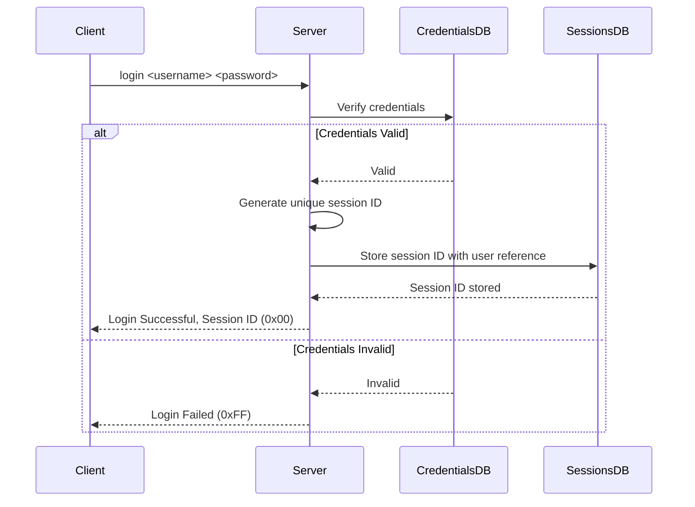

# Challenge Prompt: Library Management System - Sequence Diagram Exercise

## Objective  

For this exercise, please refer to the [spec](./spec.md)

Your task is to create sequence diagrams for the remaining operations in the Library Management System, following the pattern established in the provided Login sequence diagram. These diagrams will help you visualize and understand the interactions between the client, server, and various databases within the system.

## Provided Sequence Diagram

### Login

## Challenge Instructions

1. **Understanding the Flow:**
   - The provided sequence diagram outlines the steps for the login process, including credential verification, session ID generation, and session storage.

2. **Your Task:**
   - Using the login sequence diagram as a reference, create sequence diagrams for the following operations:
     1. **Browse**: The client requests a list of available books.
     2. **Borrow**: The client requests to borrow a book from the library.
     3. **Return**: The client returns a previously borrowed book.
     4. **Query**: The client requests a list of books they have borrowed.

3. **Considerations for Each Diagram:**
   - **Session Verification**: For each operation, start by verifying the session ID using the `SessionsDB`.
   - **Database Interactions**: Depending on the operation, interact with the appropriate database (e.g., `BooksDB` for browsing, `BorrowedBooksDB` for borrowing/returning/querying books).
   - **Conditional Logic**: Use `alt` blocks to handle different conditions, such as a valid/invalid session or available/unavailable books. (alt blocks are like if/else statements in conventional programming.)
   - **Response Handling**: Ensure the server responds with the correct RepCode (`0x01` for success, `0xFF` for failure) and any necessary data (e.g., list of available books, confirmation of a successful borrow).

4. **Format:**
   - Use whatever you want. Pen and paper, Mermaid, etc.
   - Ensure your diagrams clearly show the flow of interactions between the client, server, and databases.

5. **Evaluation Criteria:**
   - **Accuracy**: Diagrams should accurately represent the sequence of operations and interactions.
   - **Completeness**: All required operations (Browse, Borrow, Return, Query) must be diagrammed.
   - **Clarity**: Diagrams should be clear and easy to follow.

### Example Starting Point

For example, when working on the "Browse" sequence diagram, you should consider how the client requests the list of available books, how the server validates the session, and how the server interacts with the `BooksDB` to retrieve the list.
