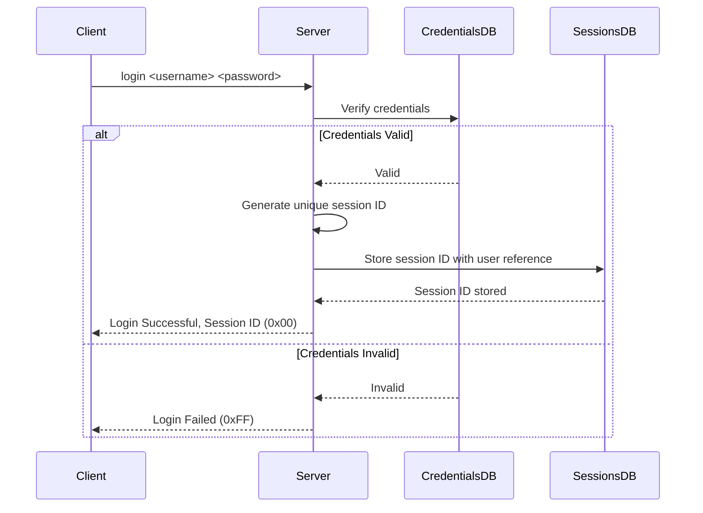
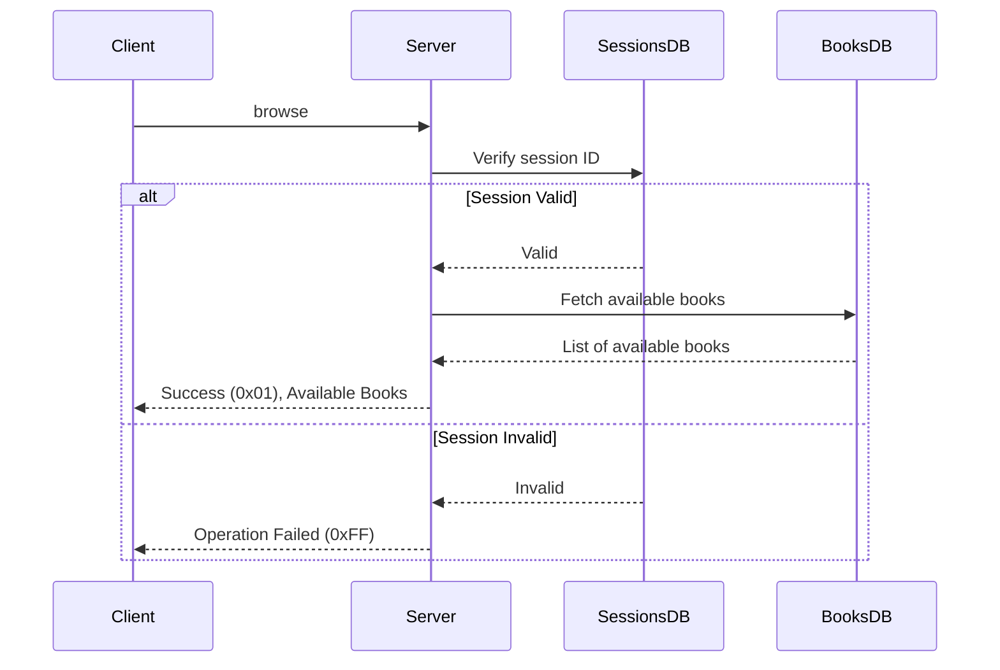
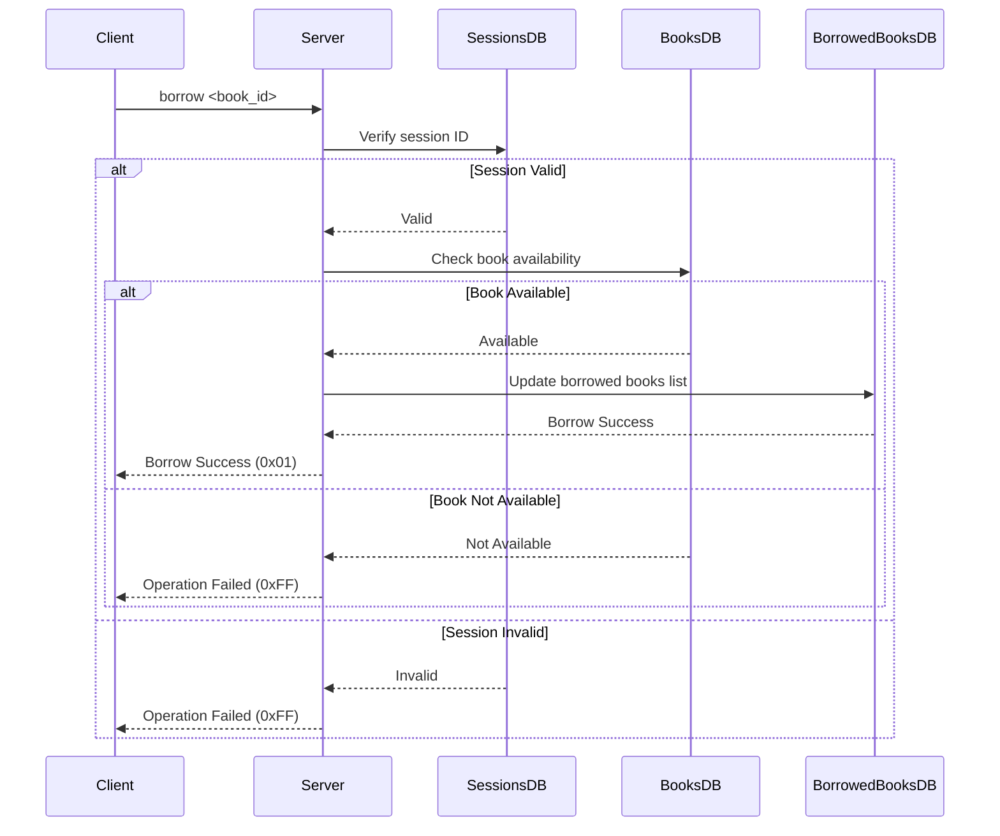
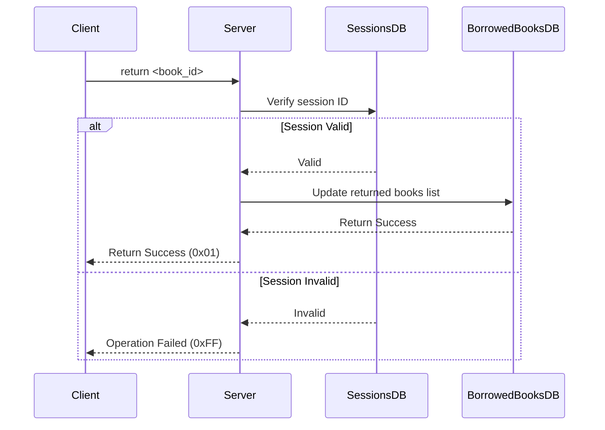
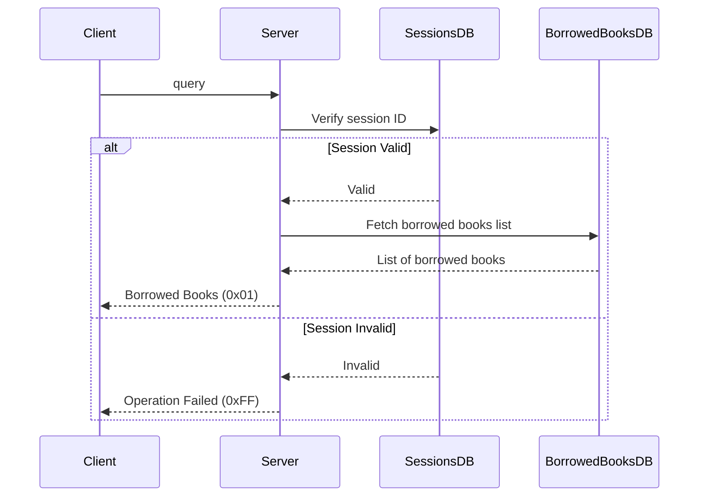

# Sequence Diagrams

## Login

```mermaid
sequenceDiagram
    participant Client
    participant Server
    participant CredentialsDB
    participant SessionsDB

    Client->>Server: login <username> <password>
    Server->>CredentialsDB: Verify credentials
    alt Credentials Valid
        CredentialsDB-->>Server: Valid
        Server->>Server: Generate unique session ID
        Server->>SessionsDB: Store session ID with user reference
        SessionsDB-->>Server: Session ID stored
        Server-->>Client: Login Successful, Session ID (0x00)
    else Credentials Invalid
        CredentialsDB-->>Server: Invalid
        Server-->>Client: Login Failed (0xFF)
    end
```

## Browse

```mermaid
sequenceDiagram
    participant Client
    participant Server
    participant SessionsDB
    participant BooksDB

    Client->>Server: browse
    Server->>SessionsDB: Verify session ID
    alt Session Valid
        SessionsDB-->>Server: Valid
        Server->>BooksDB: Fetch available books
        BooksDB-->>Server: List of available books
        Server-->>Client: Success (0x01), Available Books
    else Session Invalid
        SessionsDB-->>Server: Invalid
        Server-->>Client: Operation Failed (0xFF)
    end
```

## Borrow

```mermaid
sequenceDiagram
    participant Client
    participant Server
    participant SessionsDB
    participant BooksDB
    participant BorrowedBooksDB

    Client->>Server: borrow <book_id>
    Server->>SessionsDB: Verify session ID
    alt Session Valid
        SessionsDB-->>Server: Valid
        Server->>BooksDB: Check book availability
        alt Book Available
            BooksDB-->>Server: Available
            Server->>BorrowedBooksDB: Update borrowed books list
            BorrowedBooksDB-->>Server: Borrow Success
            Server-->>Client: Borrow Success (0x01)
        else Book Not Available
            BooksDB-->>Server: Not Available
            Server-->>Client: Operation Failed (0xFF)
        end
    else Session Invalid
        SessionsDB-->>Server: Invalid
        Server-->>Client: Operation Failed (0xFF)
    end
```

## Return

```mermaid
sequenceDiagram
    participant Client
    participant Server
    participant SessionsDB
    participant BorrowedBooksDB

    Client->>Server: return <book_id>
    Server->>SessionsDB: Verify session ID
    alt Session Valid
        SessionsDB-->>Server: Valid
        Server->>BorrowedBooksDB: Update returned books list
        BorrowedBooksDB-->>Server: Return Success
        Server-->>Client: Return Success (0x01)
    else Session Invalid
        SessionsDB-->>Server: Invalid
        Server-->>Client: Operation Failed (0xFF)
    end
```

## Query

```mermaid
sequenceDiagram
    participant Client
    participant Server
    participant SessionsDB
    participant BorrowedBooksDB

    Client->>Server: query
    Server->>SessionsDB: Verify session ID
    alt Session Valid
        SessionsDB-->>Server: Valid
        Server->>BorrowedBooksDB: Fetch borrowed books list
        BorrowedBooksDB-->>Server: List of borrowed books
        Server-->>Client: Borrowed Books (0x01)
    else Session Invalid
        SessionsDB-->>Server: Invalid
        Server-->>Client: Operation Failed (0xFF)
    end
```
