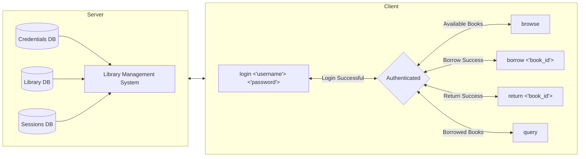

# Library Management System Server

## Description

The digital Library Management System will allow authorized users to log in, check available books, borrow books, return books, and view their borrowed books. The server will accept connections from the provided client and process incoming commands in accordance with the command table and line diagrams below. The server will only accept authorized users whose usernames and passwords are in the credentials file. To keep persistent records, the list of available books and borrowed books will be stored in respective files.

### Table 1: `users`

- **Purpose**: Store user information.
- **Primary Key**: `user_id`

| Column   | Data Type              |
| -------- | ---------------------- |
| user_id  | uint32_t (Primary Key) |
| username | char \*                |
| password | char \*                |

### Table 2: `books`

- **Purpose**: Store book information.
- **Primary Key**: `book_id`

| Column       | Data Type              |
| ------------ | ---------------------- |
| book_id      | uint32_t (Primary Key) |
| title        | char \*                |
| author       | char \*                |
| is_available | bool                   |

### Table 3: `checkouts`

- **Purpose**: To record which user has checked out which book, representing the relationship between `users` and `books`.
- **Primary Key**: Combination of `user_id` and `book_id` (composite key).
- **Foreign Keys**: `user_id` (references `users.user_id`), `book_id` (references `books.book_id`).

| Column        | Data Type                                          |
| ------------- | -------------------------------------------------- |
| checkout_id   | uint32_t (Primary Key, Auto Increment)             |
| user_id       | uint32_t (Foreign Key referencing `users.user_id`) |
| book_id       | uint32_t (Foreign Key referencing `books.book_id`) |
| checkout_date | char \*                                            |
| return_date   | char \* (nullable)                                 |

### Relationship Explanation:

- The `users` table is linked to the `books` table through the `checkouts` table, which records each instance of a user checking out a book.
- The `checkouts` table has a **many-to-one relationship** with both the `users` and `books` tables.
  - A single user can have multiple entries in the `checkouts` table for different books (one-to-many).
  - A single book can have multiple checkout records over time (one-to-many), but at any point in time, it can only be checked out by one user.

### Primary Key and Foreign Key:

- The `primary key` in the `checkouts` table is typically the combination of `user_id` and `book_id`, which ensures that a book cannot be checked out multiple times simultaneously by the same user.
- The `foreign keys` in the `checkouts` table are `user_id` and `book_id`, which reference the `users` and `books` tables respectively.

## Diagram

# Commands

## Client Command Table

The client will use a command line interface that handles the following commands in the format below:

| Command         | Description                                   | Client Usage                  |
| --------------- | --------------------------------------------- | ----------------------------- |
| **Log In**      | Authenticates this session to the system.     | `login <username> <password>` |
| **Browse**      | Views the list of available books.            | `check`                       |
| **Borrow Book** | Borrows a book from the library.              | `borrow <book_id>`            |
| **Return Book** | Returns a borrowed book to the library.       | `return <book_id>`            |
| **Query**       | Views the list of books borrowed by the user. | `query`                       |

!!! warning
Requires Authentication

## Client OpCodes

| Command | OpCode |
| ------- | ------ |
| Login   | 0x01   |
| Browse  | 0x02   |
| Borrow  | 0x03   |
| Return  | 0x04   |
| Query   | 0x05   |

## Server RepCodes

| Response Type     | RepCode |
| ----------------- | ------- |
| Login Success     | 0x00    |
| Operation Success | 0x01    |
| Operation Failure | 0xFF    |

# Packet Structures

## Login

<table style="text-align:center;">
    <colgroup>
        <col span="1" style="width:20%;">
        <col span="1" style="width:10%;">
        <col span="1" style="width:10%;">
        <col span="1" style="width:10%;">
        <col span="1" style="width:10%;">
        <col span="1" style="width:10%;">
        <col span="1" style="width:10%;">
        <col span="1" style="width:10%;">
        <col span="1" style="width:10%;">
    </colgroup>
    <thead>
        <tr>
            <td colspan=9>REQUEST</td>
        </tr>
        <tr>
            <th>Byte Location</th>
            <th>0</th>
            <th>1</th>
            <th>2</th>
            <th>3</th>
            <th>4</th>
            <th>5</th>
            <th>6</th>
            <th>7</th>
        </tr>
    </thead>
    <tbody>
        <tr>
            <td>+0</td>
            <td>OPCODE</td>
            <td colspan=3>RESERVED</td>
            <td colspan=2>USERNAME LENGTH</td>
            <td colspan=2>PASSWORD LENGTH</td>
        </tr>
        <tr>
            <td>+8</td>
            <td colspan=4>USERNAME...</td>
            <td colspan=4>PASSWORD...</td>
        </tr>
    </tbody>
</table>

<table style="text-align:center;">
    <colgroup>
        <col span="1" style="width:20%;">
        <col span="1" style="width:10%;">
        <col span="1" style="width:10%;">
        <col span="1" style="width:10%;">
        <col span="1" style="width:10%;">
        <col span="1" style="width:10%;">
        <col span="1" style="width:10%;">
        <col span="1" style="width:10%;">
        <col span="1" style="width:10%;">
    </colgroup>
    <thead>
        <tr>
            <td colspan=9>RESPONSE</td>
        </tr>
        <tr>
            <th>Byte </th>
            <th>0</th>
            <th>1</th>
            <th>2</th>
            <th>3</th>
            <th>4</th>
            <th>5</th>
            <th>6</th>
            <th>7</th>
        </tr>
    </thead>
    <tbody>
        <tr>
            <td>+0</td>
            <td>REPCODE</td>
            <td colspan=3>RESERVED</td>
            <td colspan=4>SESSION ID</td>
        </tr>
        <tr>
            <td>+8</td>
            <td colspan=8></td>
        </tr>
    </tbody>
</table>

## Browse

<table style="text-align:center;">
    <colgroup>
        <col span="1" style="width:20%;">
        <col span="1" style="width:10%;">
        <col span="1" style="width:10%;">
        <col span="1" style="width:10%;">
        <col span="1" style="width:10%;">
        <col span="1" style="width:10%;">
        <col span="1" style="width:10%;">
        <col span="1" style="width:10%;">
        <col span="1" style="width:10%;">
    </colgroup>
    <thead>
        <tr>
            <td colspan=9>REQUEST</td>
        </tr>
        <tr>
            <th>Byte Location</th>
            <th>0</th>
            <th>1</th>
            <th>2</th>
            <th>3</th>
            <th>4</th>
            <th>5</th>
            <th>6</th>
            <th>7</th>
        </tr>
    </thead>
    <tbody>
        <tr>
            <td>+0</td>
            <td>OPCODE</td>
            <td colspan=3>RESERVED</td>
            <td colspan=4>SESSION ID</td>
        </tr>
        <tr>
            <td>+8</td>
            <td colspan=8>EMPTY</td>
        </tr>
    </tbody>
</table>

<table style="text-align:center;">
    <colgroup>
        <col span="1" style="width:20%;">
        <col span="1" style="width:10%;">
        <col span="1" style="width:10%;">
        <col span="1" style="width:10%;">
        <col span="1" style="width:10%;">
        <col span="1" style="width:10%;">
        <col span="1" style="width:10%;">
        <col span="1" style="width:10%;">
        <col span="1" style="width:10%;">
    </colgroup>
    <thead>
        <tr>
            <td colspan=9>RESPONSE</td>
        </tr>
        <tr>
            <th>Byte </th>
            <th>0</th>
            <th>1</th>
            <th>2</th>
            <th>3</th>
            <th>4</th>
            <th>5</th>
            <th>6</th>
            <th>7</th>
        </tr>
    </thead>
    <tbody>
        <tr>
            <td>+0</td>
            <td>REPCODE</td>
            <td colspan=3>RESERVED</td>
            <td colspan=4>BUFFER LENGTH</td>
        </tr>
        <tr>
            <td>+8</td>
            <td colspan=8>BUFFER DATA...</td>
        </tr>
    </tbody>
</table>

## Borrow

<table style="text-align:center;">
    <colgroup>
        <col span="1" style="width:20%;">
        <col span="1" style="width:10%;">
        <col span="1" style="width:10%;">
        <col span="1" style="width:10%;">
        <col span="1" style="width:10%;">
        <col span="1" style="width:10%;">
        <col span="1" style="width:10%;">
        <col span="1" style="width:10%;">
        <col span="1" style="width:10%;">
    </colgroup>
    <thead>
        <tr>
            <td colspan=9>REQUEST</td>
        </tr>
        <tr>
            <th>Byte Location</th>
            <th>0</th>
            <th>1</th>
            <th>2</th>
            <th>3</th>
            <th>4</th>
            <th>5</th>
            <th>6</th>
            <th>7</th>
        </tr>
    </thead>
    <tbody>
        <tr>
            <td>+0</td>
            <td>OPCODE</td>
            <td colspan=3>RESERVED</td>
            <td colspan=4>SESSION ID</td>
        </tr>
        <tr>
            <td>+8</td>
            <td colspan=8>BOOK ID</td>
        </tr>
    </tbody>
</table>

<table style="text-align:center;">
    <colgroup>
        <col span="1" style="width:20%;">
        <col span="1" style="width:10%;">
        <col span="1" style="width:10%;">
        <col span="1" style="width:10%;">
        <col span="1" style="width:10%;">
        <col span="1" style="width:10%;">
        <col span="1" style="width:10%;">
        <col span="1" style="width:10%;">
        <col span="1" style="width:10%;">
    </colgroup>
    <thead>
        <tr>
            <td colspan=9>RESPONSE</td>
        </tr>
        <tr>
            <th>Byte </th>
            <th>0</th>
            <th>1</th>
            <th>2</th>
            <th>3</th>
            <th>4</th>
            <th>5</th>
            <th>6</th>
            <th>7</th>
        </tr>
    </thead>
    <tbody>
        <tr>
            <td>+0</td>
            <td>REPCODE</td>
            <td colspan=7></td>
        </tr>
    </tbody>
</table>

## Return

<table style="text-align:center;">
    <colgroup>
        <col span="1" style="width:20%;">
        <col span="1" style="width:10%;">
        <col span="1" style="width:10%;">
        <col span="1" style="width:10%;">
        <col span="1" style="width:10%;">
        <col span="1" style="width:10%;">
        <col span="1" style="width:10%;">
        <col span="1" style="width:10%;">
        <col span="1" style="width:10%;">
    </colgroup>
    <thead>
        <tr>
            <td colspan=9>REQUEST</td>
        </tr>
        <tr>
            <th>Byte Location</th>
            <th>0</th>
            <th>1</th>
            <th>2</th>
            <th>3</th>
            <th>4</th>
            <th>5</th>
            <th>6</th>
            <th>7</th>
        </tr>
    </thead>
    <tbody>
        <tr>
            <td>+0</td>
            <td>OPCODE</td>
            <td colspan=3>RESERVED</td>
            <td colspan=4>SESSION ID</td>
        </tr>
        <tr>
            <td>+8</td>
            <td colspan=8>BOOK ID</td>
        </tr>
    </tbody>
</table>

<table style="text-align:center;">
    <colgroup>
        <col span="1" style="width:20%;">
        <col span="1" style="width:10%;">
        <col span="1" style="width:10%;">
        <col span="1" style="width:10%;">
        <col span="1" style="width:10%;">
        <col span="1" style="width:10%;">
        <col span="1" style="width:10%;">
        <col span="1" style="width:10%;">
        <col span="1" style="width:10%;">
    </colgroup>
    <thead>
        <tr>
            <td colspan=9>RESPONSE</td>
        </tr>
        <tr>
            <th>Byte </th>
            <th>0</th>
            <th>1</th>
            <th>2</th>
            <th>3</th>
            <th>4</th>
            <th>5</th>
            <th>6</th>
            <th>7</th>
        </tr>
    </thead>
    <tbody>
        <tr>
            <td>+0</td>
            <td>REPCODE</td>
            <td colspan=7></td>
        </tr>
    </tbody>
</table>

## Query

<table style="text-align:center;">
    <colgroup>
        <col span="1" style="width:20%;">
        <col span="1" style="width:10%;">
        <col span="1" style="width:10%;">
        <col span="1" style="width:10%;">
        <col span="1" style="width:10%;">
        <col span="1" style="width:10%;">
        <col span="1" style="width:10%;">
        <col span="1" style="width:10%;">
        <col span="1" style="width:10%;">
    </colgroup>
    <thead>
        <tr>
            <td colspan=9>REQUEST</td>
        </tr>
        <tr>
            <th>Byte Location</th>
            <th>0</th>
            <th>1</th>
            <th>2</th>
            <th>3</th>
            <th>4</th>
            <th>5</th>
            <th>6</th>
            <th>7</th>
        </tr>
    </thead>
    <tbody>
        <tr>
            <td>+0</td>
            <td>OPCODE</td>
            <td colspan=3>RESERVED</td>
            <td colspan=4>SESSION ID</td>
        </tr>
        <tr>
            <td>+8</td>
            <td colspan=8>EMPTY</td>
        </tr>
    </tbody>
</table>

<table style="text-align:center;">
    <colgroup>
        <col span="1" style="width:20%;">
        <col span="1" style="width:10%;">
        <col span="1" style="width:10%;">
        <col span="1" style="width:10%;">
        <col span="1" style="width:10%;">
        <col span="1" style="width:10%;">
        <col span="1" style="width:10%;">
        <col span="1" style="width:10%;">
        <col span="1" style="width:10%;">
    </colgroup>
    <thead>
        <tr>
            <td colspan=9>RESPONSE</td>
        </tr>
        <tr>
            <th>Byte </th>
            <th>0</th>
            <th>1</th>
            <th>2</th>
            <th>3</th>
            <th>4</th>
            <th>5</th>
            <th>6</th>
            <th>7</th>
        </tr>
    </thead>
    <tbody>
        <tr>
            <td>+0</td>
            <td>REPCODE</td>
            <td colspan=3>RESERVED</td>
            <td colspan=4>BUFFER LENGTH</td>
        </tr>
        <tr>
            <td>+8</td>
            <td colspan=8>BUFFER DATA...</td>
        </tr>
    </tbody>
</table>
